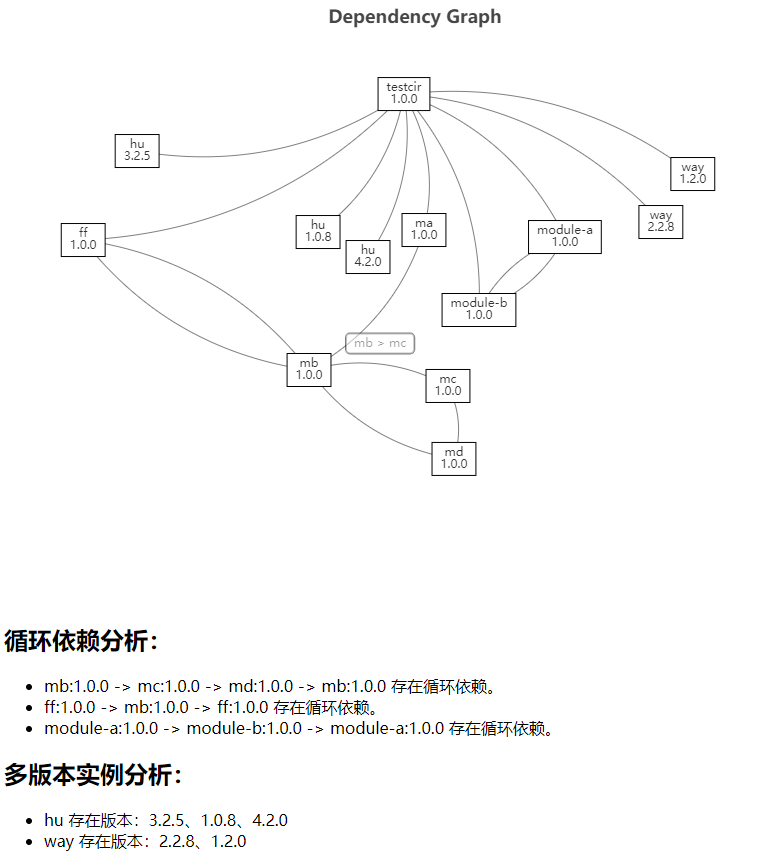

# NPM Package 分析工具

这是一个用于分析 Node.js 包依赖关系的工具，可以从 package.json 出发，递归遍历所有 node_modules 中的 package.json，并生成模块依赖关系图。该工具可以帮助你深入了解项目的依赖结构，分析循环依赖和多版本实例等问题。

## 功能特点

- 支持命令行操作，通过 `depenana-cli analyze` 命令分析项目的依赖关系。
- 可以递归查找依赖，支持指定深度限制。
- 支持将依赖关系图生成为 HTML 页面，并通过浏览器展示。
- 支持将依赖关系以 JSON 形式存储到文件中。
- 支持对依赖关系做出初步分析：包括循环依赖分析和多版本实例依赖分析。
  

## 安装与使用

### 安装

- 使用 npm 进行安装：`npm install -g depenana-cli`。

### 使用

运行以下命令来执行依赖分析：

```bash
depenana-cli analyze
```
你也可以使用其他选项来定制分析过程：

--depth <n>：限制向下递归分析的层次深度。

```bash
depenana-cli analyze --depth = n
```

--json [file-path]：将依赖关系以 JSON 形式存储到指定文件。

```bash
depenana-cli analyze --json [file-path]
```
### 示例




## 项目结构
该项目包含以下主要模块：

- analyzer.ts：分析 package.json 文件，获取依赖信息。
- dependencyAnalyzer.ts：检测循环依赖和多版本实例。
- htmlGenerator.ts：生成依赖关系图的 HTML 页面。
- index.ts：命令行工具的入口文件，处理命令行参数和执行分析操作。

## 技术栈

功能开发：ECharts 用于生成依赖关系图。

工程化：
- 使用 TypeScript 进行开发
- 使用 Jest 进行单元测试
- 接入 eslint、lint-staged 工具

## 缺陷

- 仅完成了最基础功能，当节点数量很多时可视化能力较差，需要改善。

## 待扩展功能

以下是可以添加到项目中的待扩展功能：

### 1.保存页面为图片

为了便于在文档、报告中使用，计划进一步扩展功能，使用户可以将生成的页面保存为图片格式。可以使用截图工具或浏览器截图功能，然后将截图保存为图片文件。

### 2.显示各依赖的描述说明

为了更好地了解每个节点的具体信息，计划在依赖关系图中添加节点的详细说明功能。用户可以通过鼠标悬停或点击节点来查看节点的详细信息。

### 3.设置循环依赖和多版本实例依赖的高亮标记

为了提高依赖关系图的可视化，可以在生成的 HTML 页面中，根据检测到的循环依赖和多版本实例依赖，通过修改节点样式或添加特殊标记来实现高亮显示。

### 4.设置 depth 调节按钮使能交互控制 depth 并生成对应 depth 的依赖关系图和分析

为了提高依赖关系图的可视化，还可以在生成的 HTML 页面中添加一个 depth 调节按钮，通过交互来调整 depth 值。通过调整 depth 值，可以重新生成对应 depth 的依赖关系图和分析内容并更新页面。


